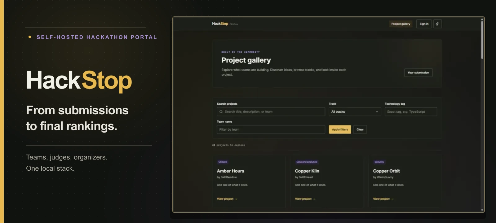
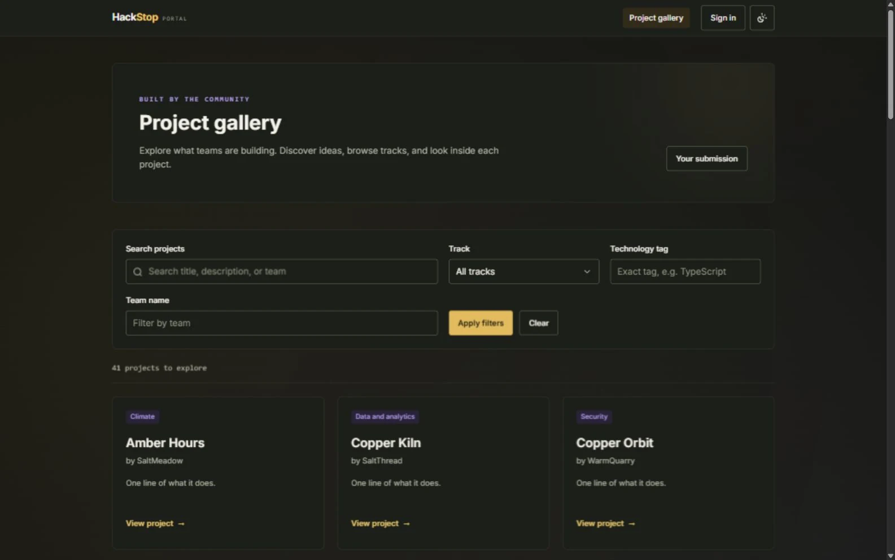
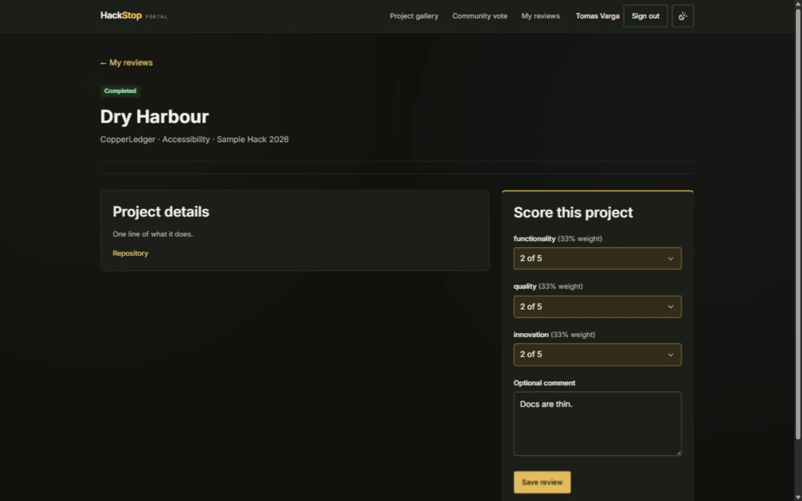
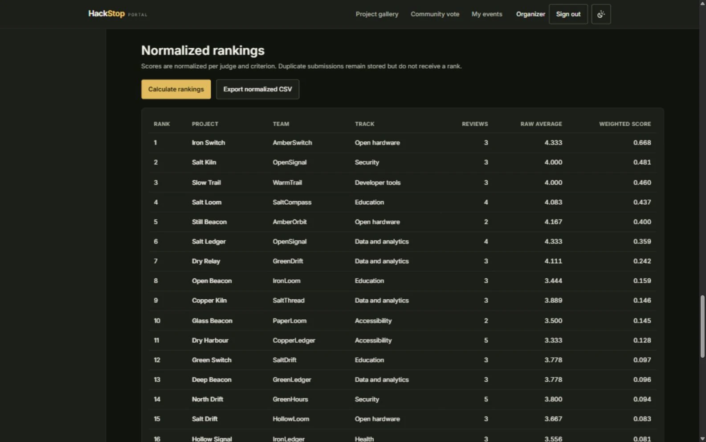

# HackStop

**Self-hosted hackathon submissions and judging, from projects to final rankings.**

Teams submit their work, judges review assigned projects, and organizers manage an event through one portal. HackStop runs with PostgreSQL in Docker Compose and exposes a documented REST API.

      



## What HackStop does

HackStop covers the path from event setup to judging results without requiring a hosted service. An organizer creates an event with tracks, prizes, submission dates, and a scoring rubric. Participants form teams by invite link and save projects as drafts until the submission deadline. Judges score only the projects assigned to them, while organizers see review progress and export normalized rankings.

The public gallery makes finished projects discoverable without an account. Eligible signed-in users can rate projects during an event's voting window; signed-in users can also comment on submitted projects. Votes, comments, and organizer-visible audit records stay in the same PostgreSQL database as the event data.

| Workspace | What it offers |
| --- | --- |
| Public gallery | Search projects and filter by track, team, or technology tag; open project details without signing in. |
| Participant | Join a team by invite link, prepare a draft, and edit a submission until the event's closing time. |
| Judge | Review assigned projects by track, score each rubric criterion, add a comment, and return to update a review before judging closes. |
| Organizer | Create events, invite and assign judges, edit rubrics, follow judging progress, inspect rankings, export CSV, and read the community audit log. |
| Admin | Use the authenticated API across events. There is no separate admin screen. |

Permissions are checked on the server. Judge score queries are restricted to the authenticated judge's own records; participant actions are tied to team membership and event deadlines. The unauthenticated visitor role can browse the gallery.

Submissions support a title, tagline, description, thumbnail, image gallery, demo video, repository and live links, technology tags, track, and event-specific questions. Drafts can be revisited; the event's stored closing timestamp decides when edits stop. The interface supports Light, Dark, and System themes. The screenshots below use Dark mode throughout.

## Inside the portal

### Discover projects

The gallery is public. Search and filters help visitors find work by title, description, team, track, and technology. Each card opens a project page with its submission details.



### Review assigned work

Judges see their own queue and score each project against the event's configurable rubric. Reviews support an optional comment and can be revised while judging remains open.



### Follow the results

Organizers can see assignment progress and ranked results, then download a CSV built from normalized results. The demo fixture includes an excluded duplicate: its submission and scores remain in the database, but it has no place in the ranking.



## Run locally

With Docker and Docker Compose installed, run this from a fresh clone:

```sh
docker compose up --build
```

Open **[localhost:8080/projects](http://localhost:8080/projects)**. No `.env`, host Node.js install, or setup script is needed for this local demo. Compose builds the application, starts PostgreSQL 16, applies migrations, loads the included fixture, and starts the portal. The app is bound to the local machine, and the database is not published to a host port. Initial image and package downloads need network access on an uncached machine; the running portal does not depend on a hosted service.

The fixture offers these starting points for each workspace:

| Role | Demo email |
| --- | --- |
| Organizer | `organizer@example.org` |
| Judge A | `tomas.varga@example.org` |
| Judge B | `wei.lindqvist@example.org` |
| Participant | `priya1@example.org` |
| Admin (API only) | `admin@example.org` |

Their local demo password comes from `SEED_PASSWORD` in [`docker-compose.yml`](docker-compose.yml); the default is intended for local evaluation, so set your own value before exposing a deployment. The seed prints four test session headers for the acceptance checker. More judge, participant, and project fixture details are in [`docs/fixtures.json`](docs/fixtures.json).

For custom values, `npm ci` followed by `npm run setup` creates a local `.env`. That step is optional for the one-command Compose path. If you change the demo credentials, regenerate the local checker configuration with `npm run dogfood:config`.

## How judging works

Organizers can change rubric criteria, scoring scales, and relative weights. Judges receive project assignments within their tracks and keep their individual scores private from other judges. The organizer's progress view reports who is assigned and how much of the work is complete.

Final rankings use a z-score for each judge and criterion, measured against that judge's own scoring pattern. The weighted results combine those normalized contributions so a consistently generous judge does not automatically lift every project they review. A constant or single-score distribution contributes `z = 0`; unscored assignments are never counted as completed reviews. Excluded duplicates remain queryable but are omitted from ranked output and CSV. The calculation, edge cases, and fixture examples are explained in [`JUDGING.md`](JUDGING.md).

During an active community voting window, participants, judges, and visitors cannot read live results; organizers and admins retain access. After the window closes, ranking access follows the organizer/admin permissions already used by judging. Community votes are authenticated 1–5 ratings, limited to one vote per user per submission. An organizer or assigned judge cannot vote on their own event. Comments also require an account. Per-user hourly limits and organizer-visible audit entries cover both actions.

## API and stack

| Layer | Technology |
| --- | --- |
| Interface | Next.js 16, React 19, TypeScript 6, Tailwind CSS 3 |
| Data | PostgreSQL 16, Prisma 6 |
| Runtime | Docker Compose |
| API | REST, OpenAPI 3.1 |

Sessions use the project's own email/password authentication, with a cookie for browser requests or a bearer token for supported API requests.

The versioned REST API is available under `/api/v1`. Its [OpenAPI 3.1 specification](docs/openapi.json) is also served at `/api/v1/openapi.json` when the portal is running. It describes resources, authentication, request parameters, and responses. Internal web routes remain available for the portal and the acceptance suite. See [`ARCHITECTURE.md`](ARCHITECTURE.md) for the system boundaries and permission model, and [`DATA-MODEL.md`](DATA-MODEL.md) for the schema.

## Develop and verify

For local development with the database exposed on loopback, stop the baseline Compose stack if it is running, then install dependencies, create a development `.env`, and start only the database with the Compose development override:

```sh
npm ci
npm run setup
docker compose -f docker-compose.yml -f docker-compose.dev.yml up -d db
npm run dev
```

The repository includes lint and type checks, tests, and a production build command:

```sh
npm run lint
npm test
npm run build
```

The official T1/T2 acceptance checker exercises the public gallery, submission deadline, judge isolation, and organizer CSV export. With the default Compose configuration, run:

```sh
python docs/run.py .dogfood.toml
```

The tracked [checker contract](docs/spec.md) and [T1 verification notes](docs/T1-VERIFICATION.md) provide more context. The included community workflows and versioned API are covered by repository tests and manual checks; the seven official checks apply specifically to T1 and T2.

## Documentation and license

- [Architecture and permissions](ARCHITECTURE.md)
- [Data model and fixture design](DATA-MODEL.md)
- [Judging and normalization](JUDGING.md)
- [OpenAPI specification](docs/openapi.json)
- [Acceptance contract](docs/spec.md)

HackStop is released under the [MIT License](LICENSE).
